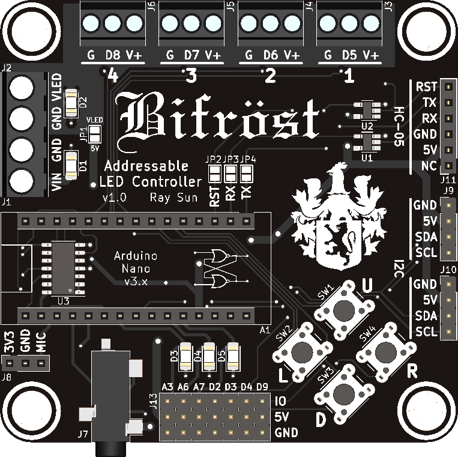

  

Arduino Nano RGB LED controller

## Description

Bifrost is an expansion board for the Arduino Nano v3.x for control of WS2811-based addressable RGB LED strips. Four LED outputs are provided for driving multiple strips; however, the RAM limitations of the ATmega328p must be kept in mind. A stereo audio jack and a socket for an [Adafruit MAX4466 electret microphone](https://www.adafruit.com/product/1063) are present for music visualization applications.

Four pushbuttons and three status LEDs onboard permit physical user control. If different peripherals are desired, an auxiliary connection header is provided for adding off-board I/O.

A socket for an HC-05 module is present, permitting serial communication and programming over Bluetooth. I2C connectors are provided for chaining multiple boards. A microSD card socket is also provided for storage of configuration settings, animations, etc.

This project is designed with KiCad EDA v.5.1.5. Documentation can be found under `/doc` and fabrication files under `/gerber`.

## Photos

## Usage
Connect DC power (7-12V recommended) to the VIN port. If LED output power is desired, connect external LED power to the VLED port. Do not attempt to draw more than 1-2A of current from any one LED output.

To power the board from the VLED input, bridge jumper JP1. 5V must be provided to VLED if JP1 is closed.

To use an HC-05 module for Bluetooth serial, bridge jumpers JP3 and JP4. Do not connect additional UART devices to the Arduino Nano hardware UART if the HC-05 is used. A 100 ohm resistor on JP3 is recommended to prevent TX bus contention. To enable Bluetooth programming, also bridge JP2.

## Author
- Ray Sun - Undergraduate, Electrical Engineering, Caltech, Class of 2020

## Licensing
This project is released under the terms of the MIT License.
